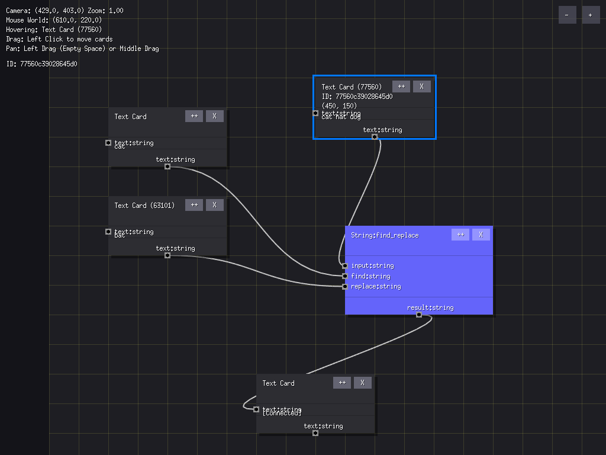

# Card Flows

> **Current Status**: Proof-of-Concept (PoC) stage.

Card Flows is an infinite canvas workflow tool designed to bring the power of automated data flows to Excel-level users. It combines a high-performance visual canvas with a deterministic logic engine.

## Getting Started

This project currently implements a basic infinite canvas engine using [Ebitengine](https://ebitengine.org/).

### Controls

- **Pan**: Left-click and drag on empty space, OR Middle Mouse Button.
- **Zoom**: Mouse Wheel.
- **Space + Left Drag**: Always pans (even over cards).

### Running the Project
```bash
go run main.go
```

---

## Documentation

- [Features](features.md): Overview of the engine, architecture, and workflow logic.
- [Ideas & Design Vision](ideas.md): Philosophy, spatial logic, and future roadmap.

## Screenshot



## License

AGPL-3.0

Enjoy!
